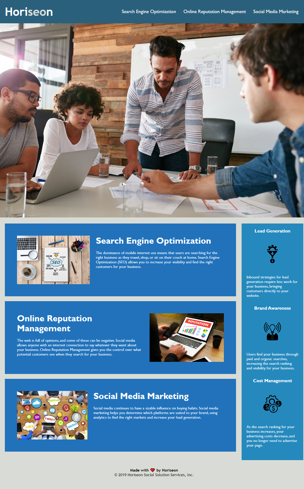

# www-horiseon

## Description
Accessibility standards were implemented so that the site is now optimized for search engines.
To accomplish this, these changes were made:

- Added semantic HTML elements to the code.
- Enhanced the HTML elements structure.
- Icons and images now have an individual alt attribute.
- Heading attributes now fall in sequential order.
- The Title element was changed for a more descriptive and concise one.

Debugging

- The Search Engine Optimization link is now working.

Technical

- CSS selectors and properties now follow the semantic structure.
- CSS selectors with same values were group together to remove repeated code.
- CSS comments were added to divide the code into different sections following the semantic structure so that by viewing it you can find the content you are looking for in a much easier and faster way.

## Usage

Click the link below to enter the site.

https://andyanza.github.io/www-horiseon/

